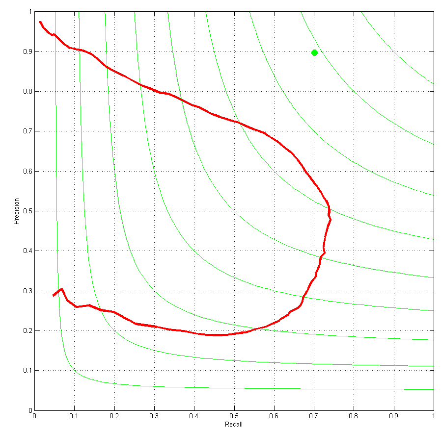
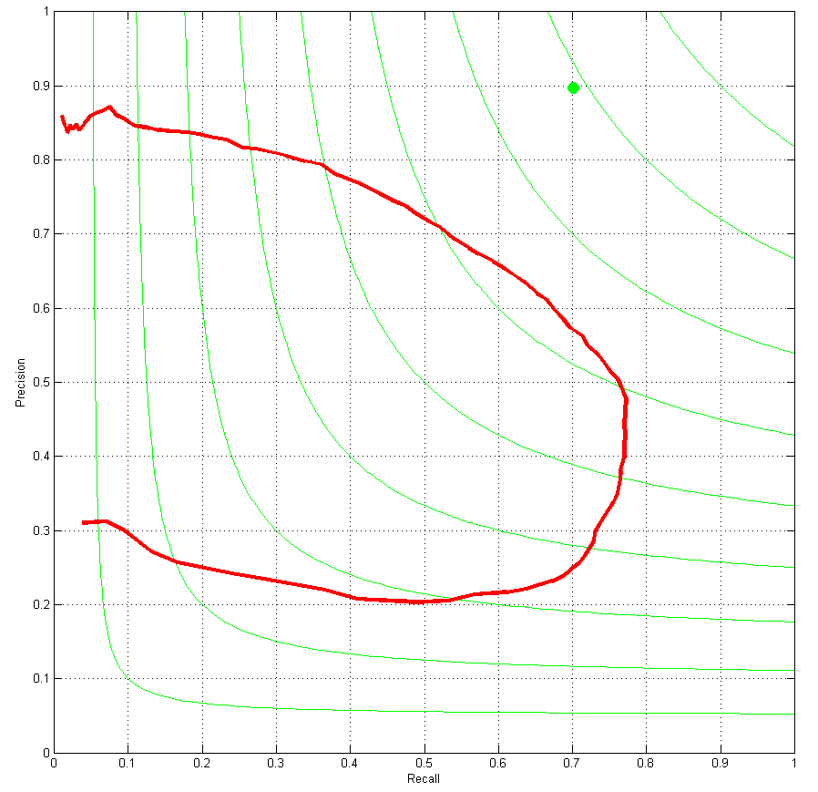

## Overview

| Index             | ODS  | ODS threshold | OIS  | AP   |
|-------------------|------|---------------|------|------|
| _Canny_ [1]       | 0.60 | -             | 0.63 | 0.58 |
| 1                 | 0.64 | 0.57          | 0.67 | 0.42 |
| 2                 | 0.64 | 0.42          | 0.66 | 0.50 |
| 5                 | 0.66 | 0.14          | 0.68 | 0.61 |
| 3                 | 0.66 | 0.41          | 0.71 | 0.62 |
| 3 (all)           | 0.68 | 0.41          | 0.70 | 0.60 |
| 4                 | 0.70 | 0.24          | 0.72 | 0.68 |
| _gPb-owt-ucm_ [2] | 0.73 | _             | 0.76 | 0.73 |

## Model Descriptions and Charts
### 1. XGBRegressor (2015/06/02)
`XGBRegressor(max_depth=10, nthread=12)` trained on first 100 images using VGG CNN F.

### 2. XGBRegressor (2015/06/09)
`XGBRegressor(max_depth=10, nthread=12, min_child_weight=2)` trained on first 50 images using VGG CNN F with Poisson-disk sampling with radius 2.

### 3. XGBRegressor (2015/06/13)
`XGBRegressor(max_depth=10, nthread=12, min_child_weight=2)` trained on first 50 images using VGG CNN F with Poisson-disk sampling with radius 2. Classifier used in this test is exactly the same as the classifier used in test #2, though the testing setup is different. Deep features suffer from low spatial resolutions. To experiment with possible solutions to this issue, in this test setup, I upscaled test images by a factor of 2 and then extracted deep features for the upscaled image and classified pixels in the upscaled image. Afterwards, the classification output was downscaled to original image size and the result was saved. As is apparent from the results table, this method has been beneficial.

### 4. XGBRegressor (2015/06/18)
`XGBRegressor(max_depth=20, nthread=24, n_estimators=150, objective='reg:logistic')` trained on the first 30 training images using VGG 16-layer model with Poisson-disk sampling with radius 4. Also no upscaling was performed when testing the classifier on test set images, despite this, results show a good enough spatial resolution is present. Benchmark results are based on all of the test images.

### 5. XGBRegressor (2015/06/20)
`XGBRegressor(max_depth=20, nthread=24, n_estimators=150, objective='reg:logistic')` trained on the first 50 training images using VGG CNN F model with Poisson-disk sampling with radius 4. In the testing phase, all of the images from the test set were used and they were upscaled when given as input to the classifier. Results show that deeper tree are only good for larger models. I think overfitting is more obvious in this set of results.

# 
[1] - Canny, John. "A computational approach to edge detection." _Pattern Analysis and Machine Intelligence, IEEE Transactions on_ 6 (1986): 679-698.

[2] - Arbelaez, Pablo, Michael Maire, Charless Fowlkes, and Jitendra Malik. "Contour detection and hierarchical image segmentation." _Pattern Analysis and Machine Intelligence, IEEE Transactions on_ 33, no. 5 (2011): 898-916.